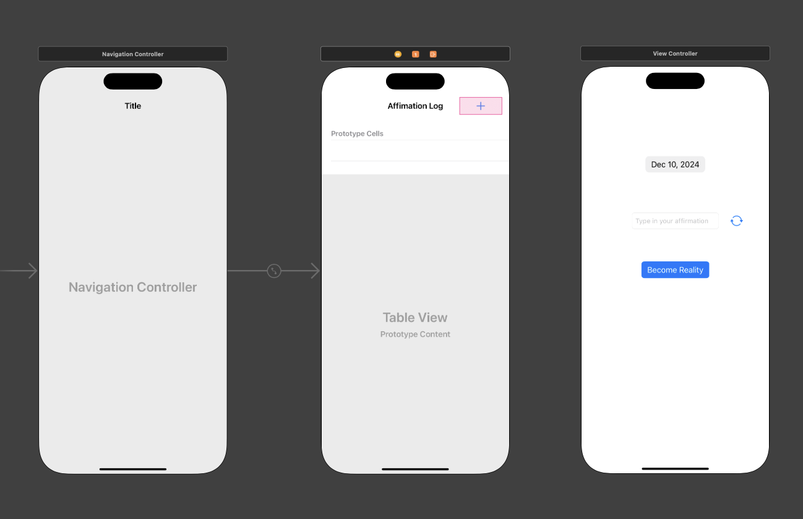
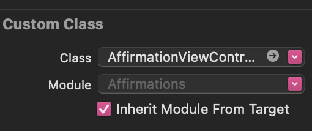
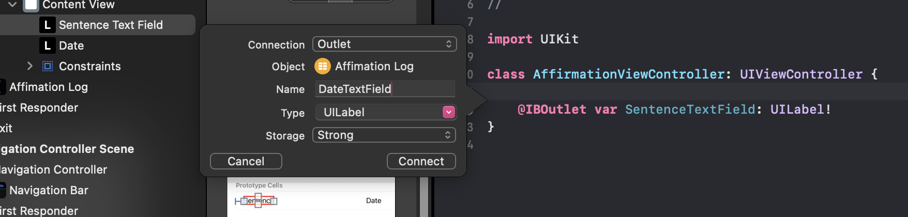
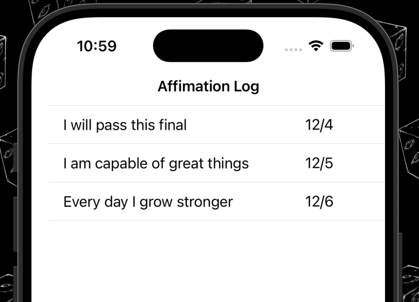
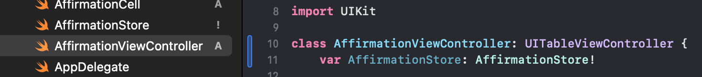
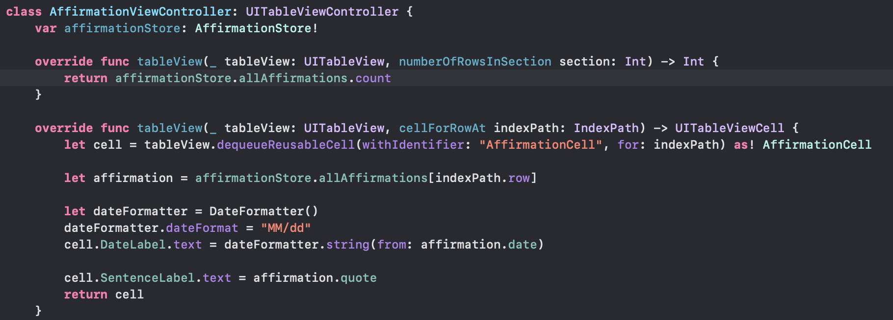
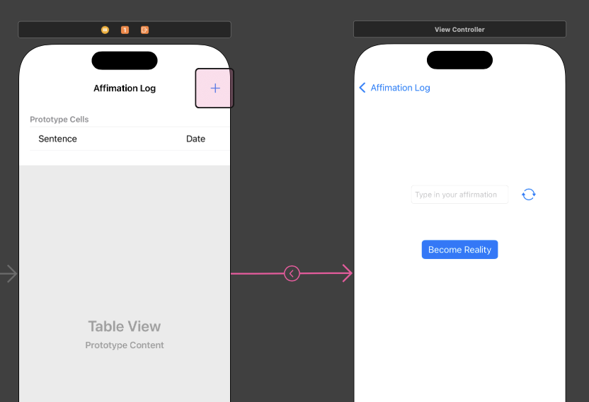
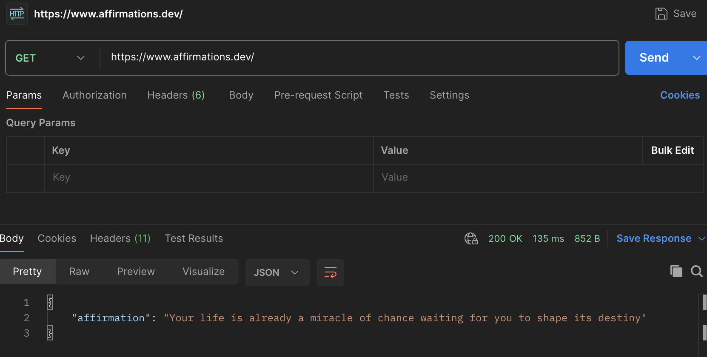

# iOS Review
## Jump To:
- [View Controller](#vc)
- [Table View Delegates](#tb)
- [Creating a Store](#creating-a-store)
- [User Input Data](#user-input-data)
- [Segue](#segue)
- [API](#apis-d)

## 1. Format Layout in Main


**Nav Controller should be set as 'Is Inital View Controller'*

## <a name="vc"></a>2. Create ViewController Classes

### a. Define classes
```swift
import UIKit

class AffirmationViewController: UIViewController {
    
}
```
```swift
import UIKit

class ItemCell: UITableViewCell {
    
    @IBOutlet var DateLabel: UILabel!
    @IBOutlet var SentenceLabel: UILabel!
}

```
## b. Add custom class to storyboard VC's (View Controllers)


*Repeat with TableView Cell VC**

## c. Connect to outlets


## <a name="tb"></a>TableView Delegates
 

### Start with test data

For my data, I will start small by having 3 records
```swift
//a list of tuples
var affirmations: [(date: String, text: String)] = [
        ("12/4", "I will pass this final"),
        ("12/5", "I am capable of great things"),
        ("12/6", "Every day I grow stronger")
]
```
### numberOfRowsInSection
The amount of rows in the TableView
```swift 
//  affirmations.count (returns 3)
override func tableView(_ tableView: UITableView, numberOfRowsInSection section: Int) -> Int {
        return affirmations.count
}
```
### cellForRowAt
What is being contained within the cell
```swift
override func tableView(_ tableView: UITableView, cellForRowAt indexPath: IndexPath) -> UITableViewCell {
    // tb view cell has the identifier 'AffirmationCell', type cast it as a cell
    let cell = tableView.dequeueReusableCell(withIdentifier: 
    "AffirmationCell", for: indexPath) as! AffirmationCell

    let affirmation = affirmations[indexPath.row]
    //the label's outlets are defined in AffirmationCell
    cell.DateLabel.text = affirmation.date
    cell.SentenceLabel.text = affirmation.text
    return cell
}
```
### Additional Things to Include
``` swift
override func viewDidLoad() {
        super.viewDidLoad()
}

override func viewWillAppear(_ animated: Bool) {
    super.viewWillAppear(animated)
    tableView.reloadData()
}
```
## Creating a Store
### a. class within the store
```swift 
import UIKit

class Affirmation: Equatable {
    var quote: String?
    var date: Date
    
    init(Quote: String?) {
        self.quote = Quote
        self.date = Date()
    }
    
    static func ==(lhs: Affirmation, rhs: Affirmation) -> Bool{
        return lhs.quote == rhs.quote
        && lhs.date == rhs.date
    }
    
}
```
### b. Affirmation Store
contains a list of Affirmations
``` swift 
import UIKit
class AffirmationStore {
    //uncomment this later
    //var AffirmationStore = [Affirmation]()
    var allAffirmations: [Affirmation] = [
            Affirmation(Quote: "I will pass this final"),
            Affirmation(Quote: "I am capable of great things"),
            Affirmation(Quote: "Every day I grow stronger")
    ]

    @discardableResult func createAffirmation(quote: String) -> Affirmation {
        let newAff = Affirmation(Quote: quote)
        allAffirmations.append(newAff)
        print(allAffirmations)
        return newAff
    }
}
```
### c. Declare Store in ViewController
 

### d. Instantiate Store in SceneDelegate
``` swift
let affirmationStore = AffirmationStore()
let navController = window!.rootViewController as! UINavigationController
let affirmationController = navController.topViewController as! AffirmationViewController
affirmationController.AffirmationStore = affirmationStore
```
### e. Update VC to include Store data
 

**Our outcome should be the same as the test Data**

## User Input Data
- Create VC Class and connect respective outlets
- In the main VC add a create function
``` swift
func addAffirmation(quote: String) {
        let newAffirmation = affirmationStore.createAffirmation(quote: quote)
        // Get the index of the new affirmation
        let newIndexPath = IndexPath(row: affirmationStore.allAffirmations.count - 1, section: 0)

        // Insert the new row into the table view
        tableView.insertRows(at: [newIndexPath], with: .automatic)
    }
```
## Segue
 

## API's :D
**TEST WITH POSTMAN OR ELSE >:(**

 

*Note: I have to invoke this call everytime I want a random quote