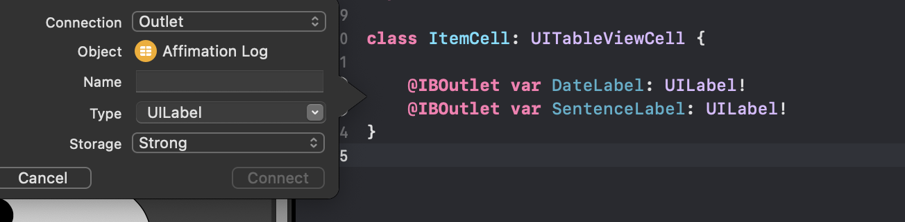

# iOS Review
## Jump To:
- [View Controller](#vc)
- [Table View Delegates](#tb)
- [API](#apis-d)
## 1. Format Layout in Main


**Nav Controller should be set as 'Is Inital View Controller'*

## <a name="vc"></a>2. Create ViewController Classes

### a. Define classes
```swift
import UIKit

class AffirmationViewController: UIViewController {
    
}
```
```swift
import UIKit

class ItemCell: UITableViewCell {
    
    @IBOutlet var DateLabel: UILabel!
    @IBOutlet var SentenceLabel: UILabel!
}

```
## b. Add custom class to storyboard VC's (View Controllers)


*Repeat with TableView Cell VC**

## c. Connect to outlets


## <a name="tb"></a>TableView Delegates
 

### Start with test data

For my data, I will start small by having 3 records
```swift
//a list of tuples
var affirmations: [(date: String, text: String)] = [
        ("12/4", "I will pass this final"),
        ("12/5", "I am capable of great things"),
        ("12/6", "Every day I grow stronger")
]
```
### numberOfRowsInSection
The amount of rows in the TableView
```swift 
//  affirmations.count (returns 3)
override func tableView(_ tableView: UITableView, numberOfRowsInSection section: Int) -> Int {
        return affirmations.count
}
```
### cellForRowAt
What is being contained within the cell
```swift
override func tableView(_ tableView: UITableView, cellForRowAt indexPath: IndexPath) -> UITableViewCell {
    // tb view cell has the identifier 'AffirmationCell', type cast it as a cell
    let cell = tableView.dequeueReusableCell(withIdentifier: 
    "AffirmationCell", for: indexPath) as! AffirmationCell

    let affirmation = affirmations[indexPath.row]
    //the label's outlets are defined in AffirmationCell
    cell.DateLabel.text = affirmation.date
    cell.SentenceLabel.text = affirmation.text
    return cell
}
```
### Additional Things to Include
``` swift
override func viewDidLoad() {
        super.viewDidLoad()
}

override func viewWillAppear(_ animated: Bool) {
    super.viewWillAppear(animated)
    tableView.reloadData()
}
```
## API's :D